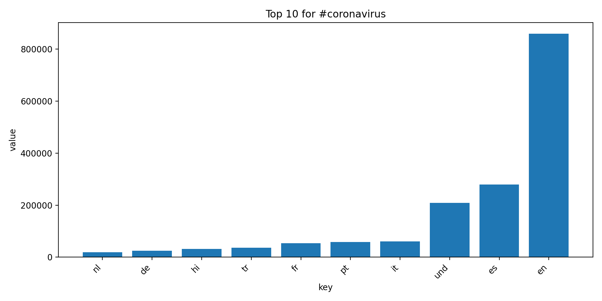
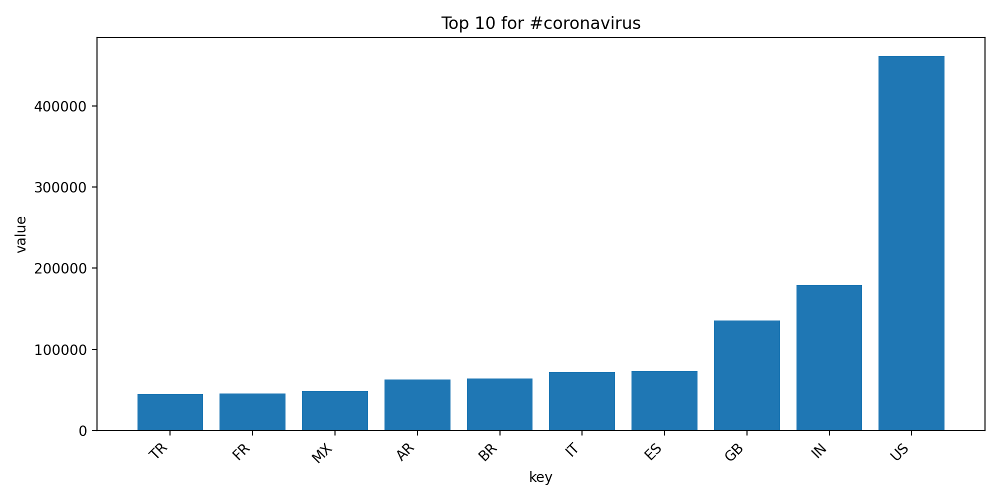
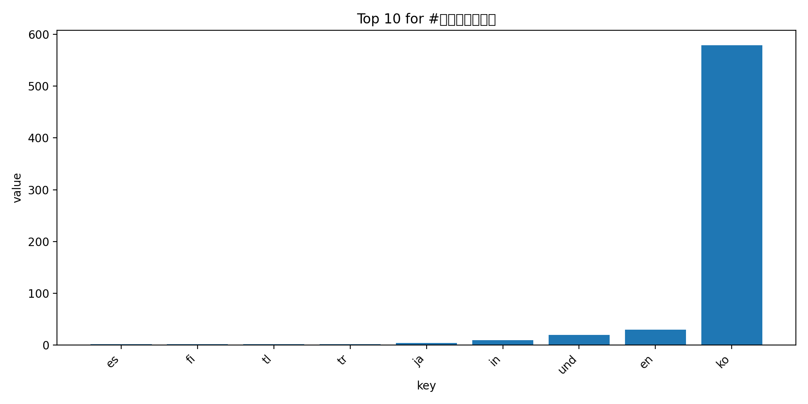
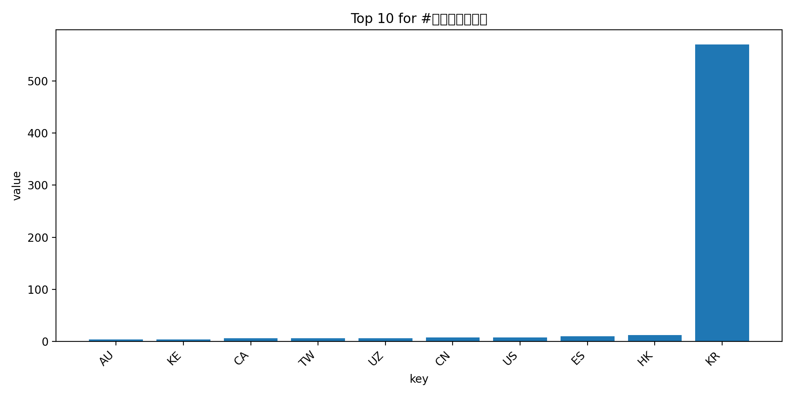
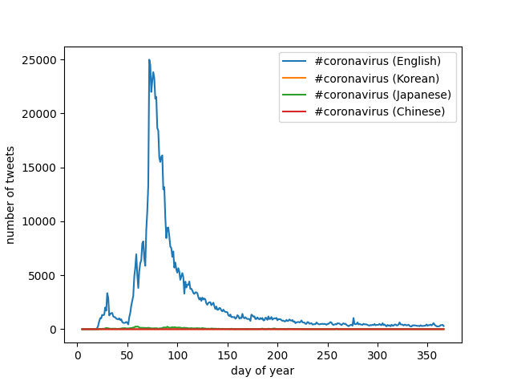

# Twitter Hashtag Analysis with MapReduce (2020 Geotagged Dataset)

## Overview
This project analyzes 1.1 billion geotagged tweets from 2020 using a custom MapReduce pipeline written in Python and executed in parallel on a Linux compute server.
The goal is to measure how selected hashtags (e.g., `#coronavirus`, `#코로나바이러스`) vary across countries, languages, and time.
Each day of tweets is processed independently in the map phase and then aggregated into global results in the reduce phase, enabling scalable large-scale data analysis. This pipeline demonstrates how large-scale social media data can be processed efficiently to reveal global communication patterns during a major public health event.

---

## Tech Stack

**Data Processing:** Python, MapReduce architecture  
**Parallel Execution:** Bash, nohup, background job control  
**Visualization:** Matplotlib  
**Environment:** Linux (lambda compute server)

---

## Dataset
Location:

/data/Twitter dataset/


- ~1.1 billion geotagged tweets  
- One compressed file per day  
- Each file contains 24 hourly JSON streams  

The dataset is too large to process locally, so all computation was executed in parallel on the lambda server.

---

## MapReduce Pipeline

### Map Phase
For each day:

```
python src/map.py --input_path <zip_file> --output_folder outputs/
```

This step extracts hashtag counts by:

language → .lang files

country → .country files

All jobs were launched in parallel using:

```
nohup ./run_maps.sh &
```

### Reduce Phase

All daily outputs are combined into global totals:

```
python src/reduce.py --input_path outputs/ --output_file reduce.lang
python src/reduce.py --input_path outputs/ --output_file reduce.country
```

### Visualization

Bar charts of the top 10 countries and languages for each hashtag are generated with:

```
python src/visualize.py --input_path <file> --key <hashtag>
```

### Alternative Reduce (Time Series)

A second reduce pipeline generates time-series plots showing daily hashtag usage over the year.
```
x-axis: day of the year
y-axis: number of tweets
one line per hashtag
```

## Key Features

- Scalable processing of 1.1B tweets using a custom MapReduce pipeline  
- Fully parallel execution across hundreds of daily data files  
- Streaming JSON parsing directly from compressed archives  
- Fault-tolerant long-running jobs with nohup  
- Automated global aggregation and visualization  

### Results:
#### Top Hashtag Usage by Language and Country

<table>
  <tr>
    <td align="center"><b>Languages – #coronavirus</b></td>
    <td align="center"><b>Countries – #coronavirus</b></td>
  </tr>
  <tr>
    <td></td>
    <td></td>
  </tr>
  <tr>
    <td align="center"><b>Languages – #coronavirus(Korean)</b></td>
    <td align="center"><b>Countries – #coronavirus(Korean)</b></td>
  </tr>
  <tr>
    <td></td>
    <td></td>
  </tr>
</table>

#### Hashtag Usage Over Time (Task 4)



This time-series view highlights the temporal dynamics of COVID-19 discussions and allows comparison of hashtag adoption across languages.

## How to Reproduce

Run the full pipeline:

```
nohup ./run_maps.sh &
python src/reduce.py --input_path outputs/ --output_file reduce.lang
python src/reduce.py --input_path outputs/ --output_file reduce.country
python src/visualize.py --input_path reduce.lang --key "#coronavirus"
```
